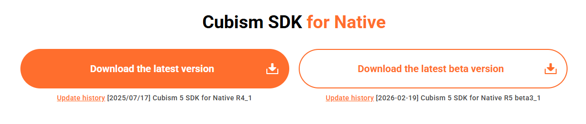
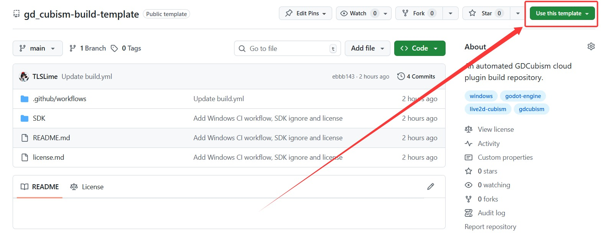
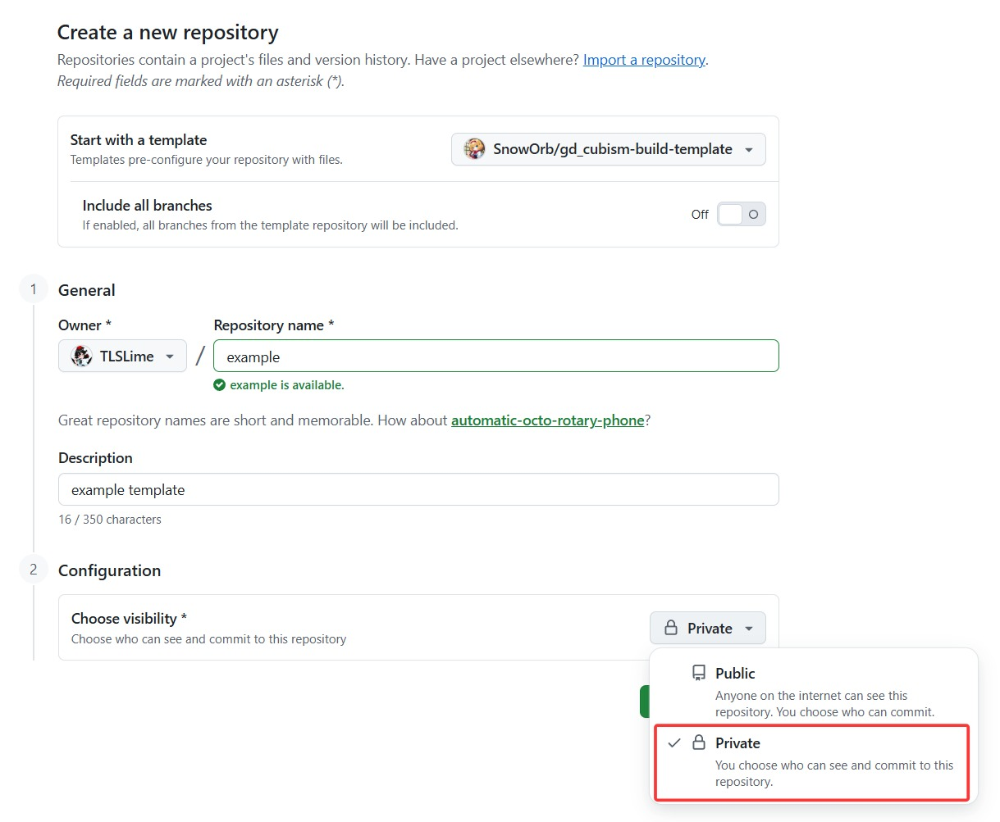
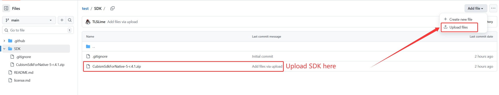
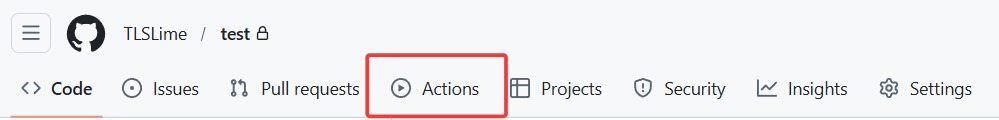
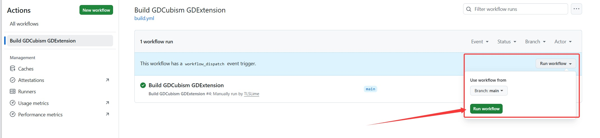
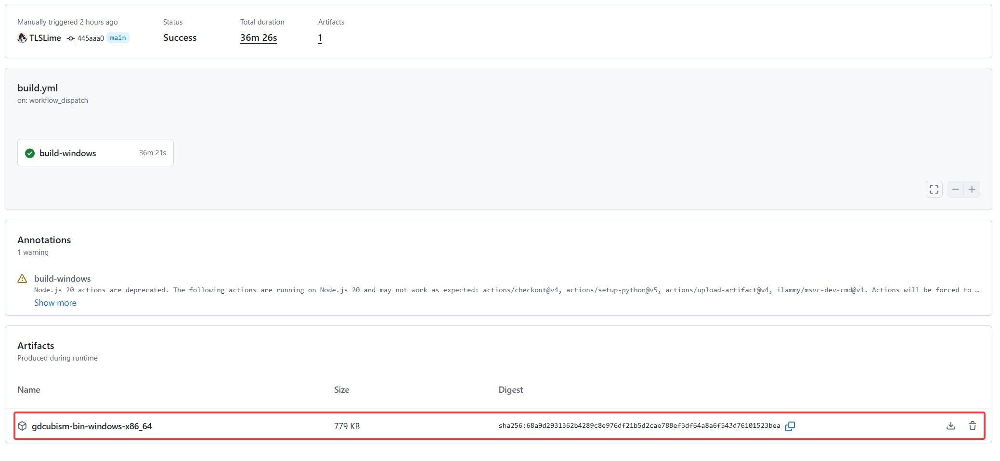
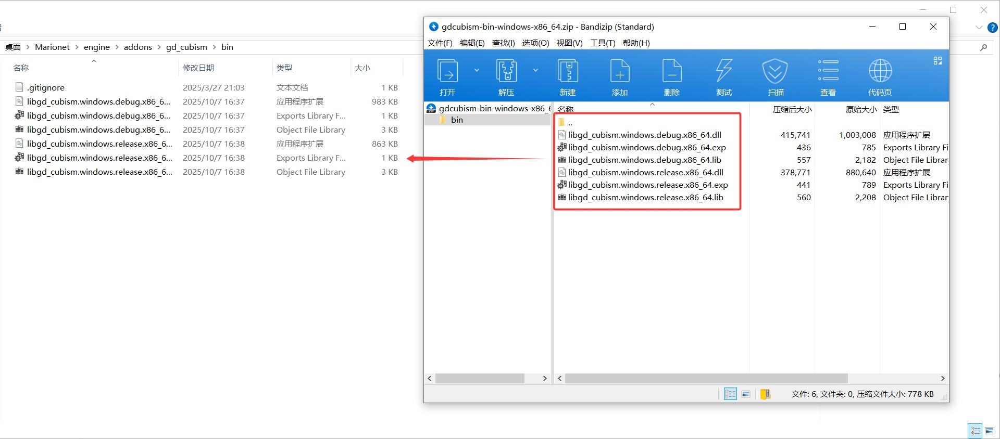

# Marionet Live2D Dependency Automated Build Template

## 项目简介

本仓库是专为“Marionet”（一款基于 Godot 引擎与 Live2D 技术开发的桌宠软件）用户设计的自动化构建模板。

Marionet 的原框架已经包含了运行所需的大部分逻辑代码与资源文件。然而，为了严格遵守 Live2D 官方的《最终用户许可协议》（EULA），原项目中并未直接提供基于闭源 SDK 编译的动态链接库（即 `addons/gd_cubism/bin` 目录下的 `.dll` 文件）。

传统的本地编译方式需要用户配置复杂的 C++ 开发环境（如 MSVC、Python、SCons 等），技术门槛较高。本模板仓库的建立旨在大幅降低入手难度，为用户提供一个简便、快捷且完全合规的依赖获取方案。

通过使用本模板，用户只需提供官方合法的 SDK 压缩包，GitHub Actions 将在云端全自动拉取底层 C++ 源码、注入 SDK 并完成编译。用户最终可直接获取到极致纯净的、可直接用于 Marionet 的二进制依赖库。

---

## 准备工作

在使用本模板之前，请确保您已具备以下条件：
1. 一个有效的 GitHub 账户。
2. 已从 Live2D 官方网站获取合法的 [Cubism SDK for Native](https://www.live2d.com/en/sdk/download/native/)。

> 注意，gdcubism插件依赖Native SDK，请注意不要下载错误版本。

---

## 使用教程

### 第一步：基于模板创建私有仓库
1. 点击本页面右上角绿色的 **[Use this template]** 按钮，选择 **[Create a new repository]**。

2. 为您的新仓库命名（名字随便起）。
3. 在可见性设置栏，选择 **Private（私有）**。

> 注：为防止违反 Live2D 的商业分发协议，本工作流内置了可见性校验机制。若在 Public（公开）仓库中运行，工作流将触发熔断机制并强行终止。

### 第二步：上传官方 SDK 压缩包
1. 进入您刚刚创建好的私有仓库。
2. 点击进入预设的 `SDK` 目录。
3. 将您从官方下载的 `.zip` 格式的 SDK 压缩包（例如 `CubismSdkForNative-5-r.1.zip`）上传至此目录中。

   *注：请务必保持压缩包原状上传，切勿在本地解压或更改其内部结构及文件名前缀。*

### 第三步：执行云端自动编译
1. 点击仓库顶部导航栏的 **Actions** 标签页。

2. 在左侧工作流列表中，点击选择 **Build GDCubism GDExtension**。
3. 点击页面右侧的 **Run workflow** 按钮启动自动化构建流程。
4. 工作流启动后，系统将在云端自动完成环境配置、源码拉取与代码编译。由于 C++ 编译（尤其是 Godot-CPP 绑定库的构建）计算量庞大，且同时包含 Debug 与 Release 两个版本，该过程通常需要持续 **35 至 40 分钟**。请耐心等待。

### 第四步：下载并安装依赖
1. 待工作流状态显示为绿色的成功标志后，点击进入该次运行的详细页面。
2. 滚动至页面最下方的 **Artifacts** 区域。
3. 下载名为 `gdcubism-bin-windows-x86_64.zip` 的构建产物。

4. 解压该文件，您将得到一个纯净的 `bin` 文件夹。
5. 将该 `bin` 文件夹内的文件完整移动至您本地 Marionet 项目的 `addons/gd_cubism/bin` 目录下即可。

---

## 注意事项与免责声明

* **耗时说明**：受限于 GitHub Actions 免费 Windows 服务器的物理性能（2 vCPU），30-40 分钟的编译时长属于正常现象，并非程序卡死。
* **架构说明**：当前工作流仅针对 Windows x86_64 平台配置并输出对应的动态链接库（.dll）。
* **合规声明**：本开源模板库自身不包含、不存储、不分发任何 Live2D 的闭源 SDK 代码或衍生二进制文件。它仅提供一套标准的 CI/CD 自动化构建脚本。最终用户必须自行对其上传的 SDK 的合法性及私有构建产物的使用场景负责。
